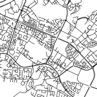
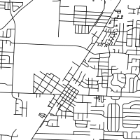
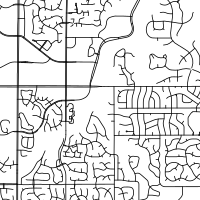
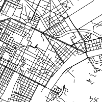

```{r setup, include=FALSE}
knitr::opts_chunk$set(echo = TRUE)
knitr::opts_chunk$set(fig.width=15)
knitr::opts_chunk$set(fig.height = 8)
knitr::opts_chunk$set(warning = FALSE)
```

## Road Pattern dataset description

The reference data-set used in this workshop come from https://geo.nyu.edu/catalog/stanford-yk247bg4748; This source contains polygons of urban areas all over the world with population estimate. Urbans ares from north and central America and from europe and russia with a population of more than 200 000 peoples were extracted form this data source.

```{r cities,cache=TRUE}
library(sf)
library(dplyr)
library(tidyr)
library(ggplot2)
library(gridExtra)
library(cartography)
set.seed(4)
cities = read_sf("./shp/Cities.shp") %>% filter(ang180!=0) %>% mutate(Cont=factor(Cont))
cont=read_sf("./shp/continent.shp")
fond = st_crop(st_transform(st_geometry(cont),3395),st_bbox(st_transform(cities,3395)))
plot(fond, col = "grey60",border = "grey20")
propSymbolsTypoLayer(st_centroid(st_transform(cities,3395)),var="Pop",var2="Cont",col=c("#e41a1c","#377eb8"),legend.var.title.txt="Population",legend.var2.title.txt="Continent              ",legend.var2.pos = "bottomleft",legend.var.pos = "n",legend.var2.frame=TRUE)
legendCirclesSymbols(pos = "topleft", 
                     var = c(200000,500000,1000000,5000000,10000000),
                     inches = 0.2, style = "e",col="gray",title.txt="Population",frame=TRUE)
```

These data were combined with the street networks extracted from open street map. This is for example the street network extracted for Appleton :

```{r,cache=TRUE}
par(mfrow=c(1,2))
roads_app = read_sf("./UrbanAreas/Pensacola.geojson")
plot(st_geometry(roads_app))
roads_app = read_sf("./UrbanAreas/Seville.geojson")
plot(st_geometry(roads_app))
```


The final dataset contains informations on 587 urban areas with the folowing features :

```{r,cache=TRUE}
str(cities[,1:6])
```

were ang180,ang185,... corresponds to the histogram of street angle for each urban area. The goal of this workshop is to study the link between street network shape and continent of origin. Population density already exhibit difference between europe and north america as shown by the fllowing histogram with a lot more of dense urban areas in europe.

```{r,cache=TRUE,fig.width=7,fig.height=4}
df_cities = cities %>% mutate(Area=as.numeric(st_area(geometry))) %>% mutate(Density=Pop/Area*10000)
ggplot(df_cities)+geom_histogram(aes(x=Density,fill=Cont),bins=25)+scale_fill_brewer(palette="Set1")
```

If we look at the street angles the diffrence between euope and north america is also quite visible.

```{r,cache=TRUE}
AnglesCounts = as.data.frame(cities)[,4:75]
df_Pa=AnglesCounts/rowSums(AnglesCounts)
levs=colnames(df_Pa)
df_Pa$City=cities$City
df_angles=gather(df_Pa,"deg","prob",-City) %>% mutate(deg=factor(deg,levels=levs)) 

exNA= cities%>% filter(Cont=="North America")  %>% sample_n(9)
ggNA=ggplot()+geom_bar(data=df_angles %>% right_join(exNA),aes(x=deg,y=prob,color=Cont,fill=Cont),stat="identity")+
  scale_y_continuous("",breaks=c())+scale_x_discrete("",breaks=c())+
  coord_polar()+facet_wrap(~City)+theme_bw()+
  scale_fill_brewer(palette="Set1",drop=FALSE,guide="none")+
  scale_color_brewer(palette="Set1",drop=FALSE,guide="none")

exEu= cities%>% filter(Cont=="Europe")  %>% sample_n(9)
ggEu=ggplot()+geom_bar(data=df_angles %>% right_join(exEu),aes(x=deg,y=prob,color=Cont,fill=Cont),stat="identity")+
  scale_y_continuous("",breaks=c())+scale_x_discrete("",breaks=c())+
  coord_polar()+facet_wrap(~City)+theme_bw()+
  scale_fill_brewer(palette="Set1",drop=FALSE,guide="none")+
  scale_color_brewer(palette="Set1",drop=FALSE,guide="none")

grid.arrange(ggEu,ggNA, nrow=1, ncol=2,top="")

```
A lot of urban areas from north america exhibit a grid pattern which are clearly visbibles in the street orientation histograms.


In this workshop we will first build classifier to recognize the region of an urban areas using two variables the population density and an feature extracted from the histogram; This will enbale the visualisation of classifier results for pedagogical goal.
In a second step we will tune classifier to recognize the region of origin using the raw histograms as input and finaly we will introduce ourself to the keras package for deep-learningby trying to classify image patches of 200x200 pixles using convolutional neural networks, (which correspond to 3km square patch) some example of training patch follow :


|   |   |   | 

The two main library that will be used in tjis workshop except the classical dplyr,tidyr,ggplot,.. are keras for neural network and caret. Caret offers a unified interface to a lot of machine learning algorithms and will ease some important tazsk such as hyper parameter tunning, model evaluation,...
```{r,cache=TRUE}
library(caret)
library(keras)
```

## Supervised classification on the plane

A classical first step in bulding a classifier is to split the dataset into a training and a testing set and performing some preprocessing such as feature standardization (subtract the mean, and divide by the standard deviation erach feature). In this first code block we compute the entropie of the road orientation histogram, this will give us a measure of the predictability of these angles and build a data frame Xp with three varibales :

```{r,cache=TRUE}
entropie = -rowSums(df_Pa %>% select(-City)*log2(df_Pa %>% select(-City)))
Xp = as.data.frame(df_cities) %>% select(Cont,Density)
Xp$entropie=entropie
str(Xp)
```
The continent of the urban area (North America,Europe) which is the target feature and two predictors. then we may use the createDataPartition and preProcess functions to split and normalize this dataset (normalization is important here for several methods since raw features have quite different ranges.)

```{r,cache=TRUE}
intrain  = createDataPartition(Xp$Cont, list=FALSE,p = 0.75)
scaler = preProcess(Xp[intrain,-1])
Xp.train = predict(scaler,Xp[intrain,-1])
Xp.train$Cont=Xp$Cont[intrain]
Xp.test  = predict(scaler,Xp[-intrain,-1])
Xp.test$Cont=Xp$Cont[-intrain]
```

We may get a first picture of this simple dataset using a scatter plot. Urban areas from north america exhibit a lower density and an hhigher entropie. These variable may then be helpfull to distinguish these two classes. We will start by running two classical classifier namely logistic regression and k-nn.

```{r,cache=TRUE,fig.width=7,fig.height=6}
ggplot(Xp.train)+geom_point(aes(x=Density,y=entropie,color=Cont),size=3)+scale_color_brewer(palette="Set1",drop=FALSE)+coord_equal()
```

### GLM
We start with a simple logistic regression, which can easyly be estimated in R thanks to the GLM function. The target feature must ve a factor and the family argument must be set to binomial. The predict function return log-odds by default but the "response" type argument can be used to get probabilities. These probaibilities can then be used to reconstruct most probable decision and compute a confusion matrix on the train set by comparing the true label with the predicted ones.

```{r,cache=TRUE}
fit = glm(Cont~.,data=Xp.train,family = binomial)
classes = levels(Xp.train$Cont)
predlab.train = factor(classes[(predict(fit,Xp.train,type="response")>0.5)+1],levels = classes)
mc.train = confusionMatrix(predlab.train,Xp.train$Cont)
mc.train
```

The confusionMatrix from the caret package give a lot of statistics used in classification to asses the performances of a classifier derived from the confusion matrix. Lets focus on accuracy for the moment, which is close to 76\%. Here we used the training set to compute this statistics and this estimation of the performances of our classifier could be optimistic. We may used our testing set to asses in a more robust fashion the perforamces :


```{r,cache=TRUE}
predlab.test = factor(classes[(predict(fit,Xp.test,type="response")>0.5)+1],levels = classes)
mc.test = confusionMatrix(predlab.test,Xp.test$Cont)
mc.test$overall[1]
```

We get an accuracy close to the one obatined on the training set but a little bit lower.


```{r,cache=TRUE}
Xpgrid= expand.grid(Density=seq(min(Xp.train$Density),max(Xp.train$Density),length.out=100),entropie=seq(min(Xp.train$entropie),max(Xp.train$entropie),length.out=100))
proba = predict(fit,Xpgrid,type="response")
Xpgrid$proba=1-proba
ggplot(Xpgrid)+geom_tile(aes(x=Density,y=entropie,fill=proba),alpha=0.4)+scale_fill_distiller(palette="RdBu")+geom_point(data=Xp.train,aes(x=Density,y=entropie,shape=Cont,color=Cont),size=2)+coord_equal()+scale_color_brewer(palette="Set1",drop=FALSE)
```

### K-nn
```{r,cache=TRUE}
fit.knn=knn3(Cont~.,data=Xp.train,k=1)
predlab.train = predict(fit.knn,Xp.train,type="class")
mc.train = confusionMatrix(predlab.train,Xp.train$Cont)
mc.train
```

```{r,cache=TRUE}
predlab.test = predict(fit.knn,Xp.test,type="class")
mc.test = confusionMatrix(predlab.test,Xp.test$Cont)
mc.test$overall[1]
```

```{r,cache=TRUE}
grid = expand.grid(k=1:40)
control = trainControl(method="repeatedcv", number=10,repeats=5)
fitcv <- train(Cont~., data=Xp.train, method="knn", metric="Accuracy", trControl=control,tuneGrid=grid)
# display results
ggplot(fitcv$results)+geom_line(aes(x=k,y=Accuracy))+
  geom_linerange(aes(x=k,ymin=Accuracy-AccuracySD,ymax=Accuracy+AccuracySD))+
  scale_y_continuous(limits=c(0.5,1))+
  geom_point(aes(x=k,y=Accuracy),fill="white",size=4,shape=21)
```
```{r,cache=TRUE}
Xpc=Xp.train
Xpgrid= expand.grid(Density=seq(min(Xpc$Density),max(Xpc$Density),length.out=100),entropie=seq(min(Xpc$entropie),max(Xpc$entropie),length.out=100))

fit.knn=knn3(Cont~.,data=Xp.train,k=1)
proba = predict(fit.knn,Xpgrid)
Xpgrid$proba=proba[,1]

ggplot(Xpgrid)+geom_tile(aes(x=Density,y=entropie,fill=proba),alpha=0.4)+scale_fill_distiller(palette="RdBu")+geom_point(data=Xp.train,aes(x=Density,y=entropie,shape=Cont,color=Cont),size=2)+coord_equal()+scale_color_brewer(palette="Set1",drop=FALSE)
```
```{r,cache=TRUE}
fit.knn=knn3(Cont~.,data=Xp.train,k=7)
proba = predict(fit.knn,Xpgrid)
Xpgrid$proba=proba[,1]
ggplot(Xpgrid)+geom_tile(aes(x=Density,y=entropie,fill=proba),alpha=0.4)+scale_fill_distiller(palette="RdBu")+geom_point(data=Xp.train,aes(x=Density,y=entropie,shape=Cont,color=Cont),size=2)+coord_equal()+scale_color_brewer(palette="Set1",drop=FALSE)
```

```{r,cache=TRUE}
predlab.test = predict(fit.knn,Xp.test,type="class")
mc.test = confusionMatrix(predlab.test,Xp.test$Cont)
mc.test$overall[1]
```


### Questions 

Helpyourself in using caret to fit a cart tree and tune its regularization parameter. More information and method anme and hyper parameters names can be found in caret's help.
https://topepo.github.io/caret/train-models-by-tag.html. Visualize the decision of your classifier iun the feature space and compute the model test accuracy.


## Classification with raw fetaures 

```{r,cache=TRUE}
Xa = cbind(df_Pa[,1:36],as.data.frame(df_cities)[,c(2,3,76)])
intrain  = createDataPartition(Xa$Cont, list=FALSE,p = 0.75)
scaler= preProcess(Xa[intrain,])
Xa.train = predict(scaler,Xa[intrain,])
Xa.test  = predict(scaler,Xa[-intrain,])

fit.knn=knn3(Cont~.,data=Xa.train,k=7)
predlab.test = predict(fit.knn,Xa.test,type="class")
mc.test = confusionMatrix(predlab.test,Xa.test$Cont)
mc.test$overall[1]
```


```{r,cache=TRUE}
grid = expand.grid(k=1:30)
control = trainControl(method="cv", number=10)
fit <- train(Cont~., data=Xa.train, method="knn", metric="Accuracy", trControl=control,tuneGrid=grid)
# display results
ggplot(fit$results)+geom_line(aes(x=k,y=Accuracy))+geom_linerange(aes(x=k,ymin=Accuracy-AccuracySD,ymax=Accuracy+AccuracySD))+geom_point(aes(x=k,y=Accuracy),fill="white",size=4,shape=21)+scale_y_continuous(limits=c(0.5,1))
```

```{r,cache=TRUE}
grid = gbmGrid <-  expand.grid(interaction.depth = c(5,10), 
                        n.trees = 2500, 
                        shrinkage = 0.1,
                        n.minobsinnode = 10)
control = trainControl(method="cv", number=10)
fit <- train(Cont~., data=Xa.train, method="gbm", metric="Accuracy", trControl=control,tuneGrid=grid,verbose=FALSE)
# display results
ggplot(fit)
```

```{r,cache=TRUE}
predlab.test = predict(fit,Xa.test)
mc.test = confusionMatrix(predlab.test,Xa.test$Cont)
mc.test$overall[1]
```


### ConvNN and keras on image patchs

```{r,cache=TRUE}
library(abind)
library(caret)
# path to image folders
train_image_files_path <- "./ImgTrain/"
val_image_files_path <- "./ImgVal/"
img_width = 200
img_height = 200
cls = c("Europe","NorthAmerica")
target_size = c(img_width, img_height)
```

```{r,cache=TRUE}
data_gen = image_data_generator(
  rescale = 1/255
)


# training images
train_image_array_gen <- flow_images_from_directory(train_image_files_path, 
                                                    data_gen,
                                                    target_size = target_size,
                                                    class_mode = "categorical",
                                                    classes = cls,
                                                    color_mode = "grayscale",
                                                    seed = 42)

# validation images
val_image_array_gen <- flow_images_from_directory(val_image_files_path, 
                                                    data_gen,
                                                    target_size = target_size,
                                                    class_mode = "categorical",
                                                    classes = cls,
                                                    color_mode = "grayscale",
                                                    seed = 42)

```


```{r,cache=TRUE}
# define batch size and number of epochs
batch_size <- 100
epochs <- 20


# initialise model
model <- keras_model_sequential()

# add layers
model %>%
  layer_conv_2d(filter = 15, kernel_size = c(5,5), padding = "same", input_shape = c(img_width, img_height,1)) %>%
  layer_activation("relu") %>%

  # Use max pooling
  layer_max_pooling_2d(pool_size = c(5,5)) %>%

  layer_conv_2d(filter = 15, kernel_size = c(5,5), padding = "same", input_shape = c(img_width, img_height,1)) %>%
  layer_activation("relu") %>%
  
  # Use max pooling
  layer_max_pooling_2d(pool_size = c(5,5)) %>%
  
  # Flatten max filtered output into feature vector 
  # and feed into dense layer
  layer_flatten() %>%
  layer_dense(20) %>%
  layer_activation("relu") %>%

  
  # Outputs from dense layer are projected onto output layer
  layer_dense(2) %>% 
  layer_activation("softmax")

```

```{r,cache=TRUE}
# compile
model %>% compile(
  loss = "categorical_crossentropy",
  optimizer = optimizer_adam(),
  metrics = "accuracy"
)
```


```{r,cache=TRUE}
# fit
# number of training samples
train_samples <- train_image_array_gen$n
# number of validation samples
val_samples <- val_image_array_gen$n

hist <- model %>% fit_generator(
  # training data
  train_image_array_gen,
  
  # epochs
  steps_per_epoch = as.integer(train_samples/batch_size), 
  epochs = epochs, 
  
  # validation data
  validation_data = val_image_array_gen,
  validation_steps = as.integer(val_samples/batch_size)
  
)

```

```{r,cache=TRUE}
# Testing 

image_paths = list.files("./ImgTest", recursive = FALSE, full.names = TRUE)
image_preprocessor = function(image_path) {
  image = image_load(image_path, target_size = c(200,200),grayscale=TRUE)
  image = image_to_array(image)
  image = array_reshape(image, c(1, dim(image)))
  image = image/255
  return(image)
}

label_extract = function(image_path) {
  classes = c("Europe","NorthAmerica")
  image_path=gsub("./ImgTest/","",image_path)
  classes[as.numeric(substr(image_path,1,1))]
}

sa=sample(length(image_paths),1000) 
image_list = lapply(image_paths[sa], image_preprocessor)
test_images=abind(image_list,along=1)

test_labels=factor(sapply(image_paths[sa],label_extract),cls)
pred_prob=model %>% predict_proba(test_images)
pred_cl=factor(cls[apply(pred_prob,1,which.max)],cls)
confusionMatrix(pred_cl,test_labels)
```

```{r,cache=TRUE,fig.width=12,fig.height=12.1}

im2gg = function(im){
  im.df=data.frame(im)
  names(im.df)=1:nrow(im)
  im.df$row=1:nrow(im)
  im.df.long=gather(im.df,"col","gray",-row,convert=TRUE)
}

p=list()
ex_test = sample(1000,25)
ip=1
for (i in ex_test){
  p[[ip]]=ggplot(im2gg(test_images[i,,,]))+geom_tile(aes(x=row,y=col,fill=gray))+
    coord_equal()+
    theme(plot.title = element_text(color=ifelse(test_labels[i]==pred_cl[i],"#008000","#800000"), size=8, face="bold.italic"),
          axis.line=element_blank(),
          axis.text.x=element_blank(),
          axis.text.y=element_blank(),
          axis.ticks=element_blank(),
          axis.title.x=element_blank(),
          axis.title.y=element_blank(),
          legend.position="none",
          panel.background=element_blank(),
          panel.border=element_blank(),
          panel.grid.major=element_blank(),
          panel.grid.minor=element_blank(),
          plot.background=element_blank(),
          panel.spacing = unit(c(0, 0, 0, 0), "cm"), 
          plot.margin = unit(c(0, 0, 0, 0), "cm"))+
    scale_fill_continuous(guide="none",low="black",high="white")+
    ggtitle(paste0(test_labels[i],"/",pred_cl[i],": ",round(max(pred_prob[i,])*100),"%"))
  ip=ip+1
}

ml <- marrangeGrob(p, nrow=5, ncol=5,top="Ten test patches results")
ml
```


